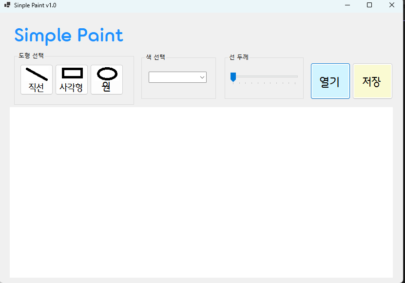
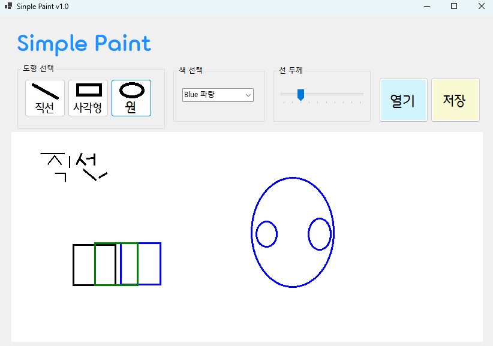
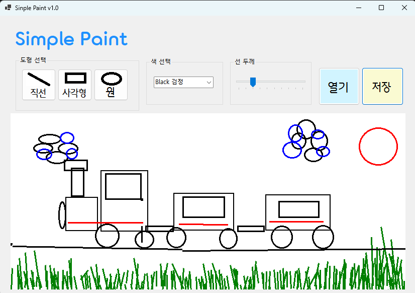
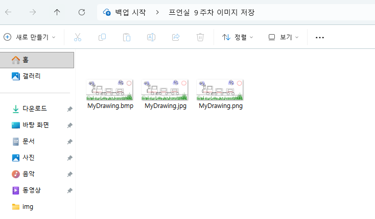

# [C# 코딩] 그림판 만들기

## 개요
- C# 프로그래밍 학습
- 1줄 소개 : 두 폴더의 파일들을 비교하여 상호 복사하는 툴.
- 사용한 플랫폼 : C#, .NET Windows Forms, Visual Studio, Github.
- 사용한 컨트롤: label, textbox, button, trackbarm, picturebox 등.
- 사용한 기술과 구현한 기능 : 기본 UI 배치.

## 실행 화면 (과제1)
- 과제1 코드의 실행 스크린 샷

- 과제 내용
	- 컨트롤 배치와 기본적인 속성 설정
	- 컨트롤 이름 정하기
	- 도형 선택, 색상선택, 선굵기 선택 가능한 기능 기본으로 구현하기

- 구현 내용과 기능 설명
	- UI 구성 : 도형 선택, 색상 선택, 선 굵기 선택을 위한 컨트롤 배치
	- GUI설계, 컨트롤 배치를 완료하였습니다.
	-  컨트롤에서 기본적으로 제공하는 기능에 대해 구동 확인하였습니다.
	- Trackbar, Combobox, Picturebox 등 다양한 컨트롤을 활용하여 UI를 구성하였습니다.

## 실행 화면 (과제2)
- 과제2 코드의 실행 스크린 샷

- 과제 내용
		- 마우스 드래그를 이용한 그림 그리기 기능 구현
		- 도형, 직선 등등.

- 구현 내용과 기능 설명
	- 직선, 사각형, 원 등 다양한 도형을 마우스 드래그로 그릴 수 있는 기능을 구현하였습니다. 
	- 버튼 선택 구현
	- ComboBox 선택을 통해 색상 변경을 구현하였습니다. 
	- TrackBar를 통한 선 굵기 변경을 구현하였습니다.
	- 색깔의 경우 검은색, 빨간색, 파란식, 노란색 등 다양한 색상을 선택할 수 있도록 구현하였습니다.

## 실행 화면 (과제3)
- 과제3 코드의 실행 스크린 샷

- 과제 내용
		- 그려진 그림을 이미지 파일로 저장하는 기능 구현

- 구현 내용과 기능 설명
	- 파일 저장을 위한 대화상자인 SaveFileDialog 를 사용하였습니다.
	- png, jpg, bmp총 3가지 포맷으로 저장이 되는 것을 확인할 수 있습니다.
	- 별도의 선택없이 저장 한 번에 3종류의 이미지로 나누어서 저장이 되도록 하였습니다.